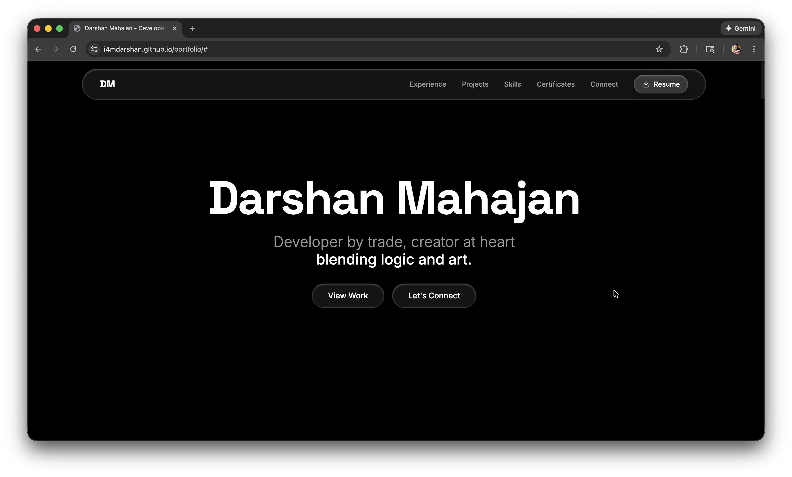

# ✨ Personal Portfolio

A modern, animated developer portfolio that blends **logic and creativity**—designed to showcase my professional journey, projects, skills, and creative pursuits through smooth interactions and thoughtful architecture.

This portfolio is not just a website; it’s an experiment in translating creative intent into scalable, maintainable code.

  

---

## 🚀 Overview

This project is built with **React, TypeScript, and Framer Motion**, focusing on:

- Clean, scalable architecture
- Smooth, meaningful animations
- Mobile-first responsiveness
- Strong separation of concerns
- A creative workflow powered by **Lovable**

Lovable was used as a creative partner—**prompt-engineered to translate design intent and architectural decisions into code**, while maintaining consistency with my established React architecture patterns.

---

## 🎨 Key Features

- ⚡ **Fluid animations** using Framer Motion
- 📱 **Fully responsive** across mobile, tablet, and desktop
- 🧠 **Global state management** for predictable UI behavior
- 🧩 **Component-driven architecture** following reusable design patterns
- 🎯 Clear separation between UI, state, and motion logic
- 🖼️ Creative sections highlighting both **technical** and **artistic** work

---

## 🧱 Architecture

The codebase follows the same **React architecture patterns** I use in production projects:

- Feature-based folder structure
- Strongly typed components with TypeScript
- Centralized global state management
- Reusable UI primitives
- Motion logic isolated from business logic

Lovable was **prompt-engineered** to:
- Respect and maintain the existing architecture
- Generate components that align with established patterns
- Evolve the codebase without introducing architectural drift

This ensured creativity did not come at the cost of maintainability.

---

## 🛠️ Tech Stack

- **React**
- **TypeScript**
- **Framer Motion**
- **Tailwind CSS**
- **Lovable**

---

## 📱 Responsiveness & Motion

The portfolio is built with a **mobile-first approach**, ensuring:

- Seamless layouts across screen sizes
- Performance-friendly animations
- Motion that enhances UX without overwhelming content

Animations are purposeful—used to guide attention, communicate hierarchy, and add personality.

---

## 🌱 Purpose

This project represents how I approach software development:

> Creativity isn’t separate from logic—it’s what happens when curiosity guides problem-solving.

The portfolio reflects how I build systems that are:
- Functional
- Scalable
- Thoughtfully designed
- And visually engaging

---

## 📄 License

This project is open for inspiration and learning.  
Feel free to explore the ideas—but please do not reuse the design or content directly.

---

Built with ❤️, curiosity, and code.
